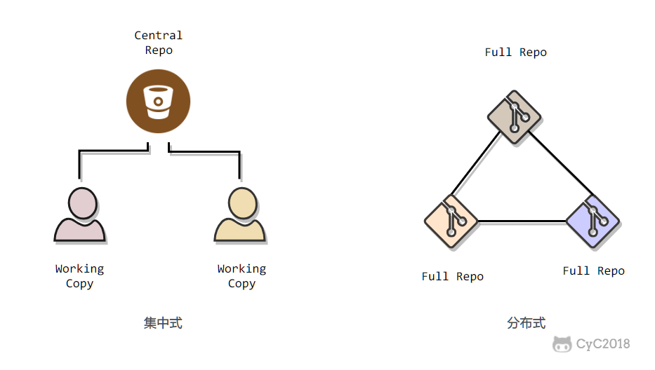
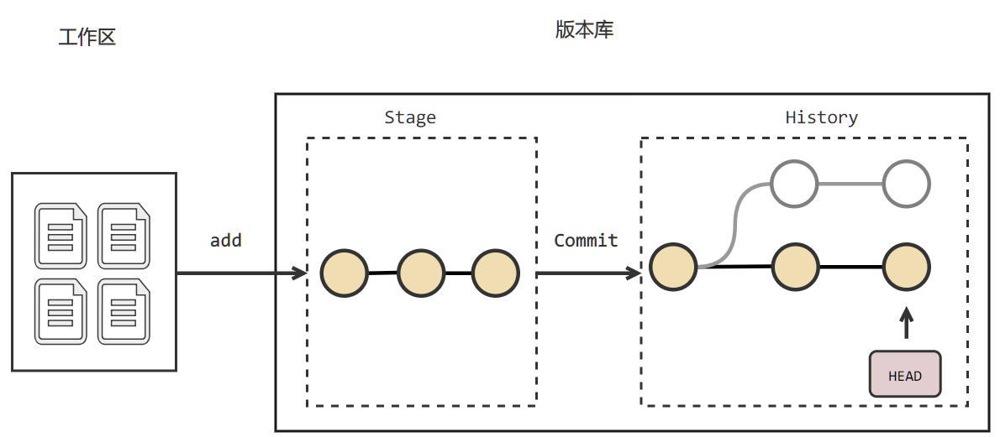
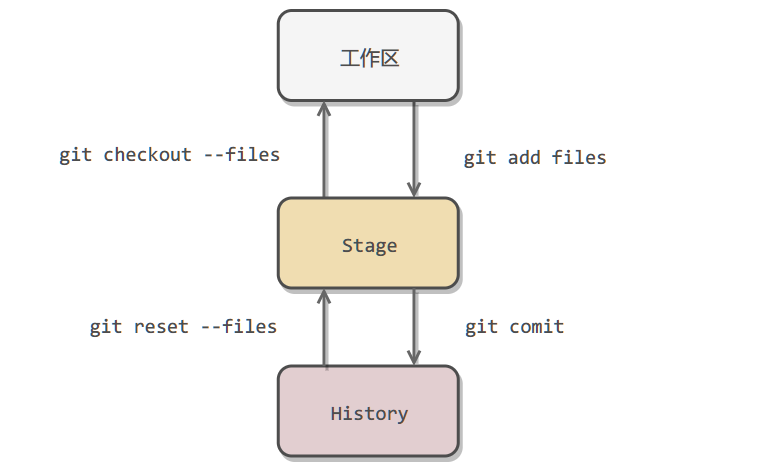
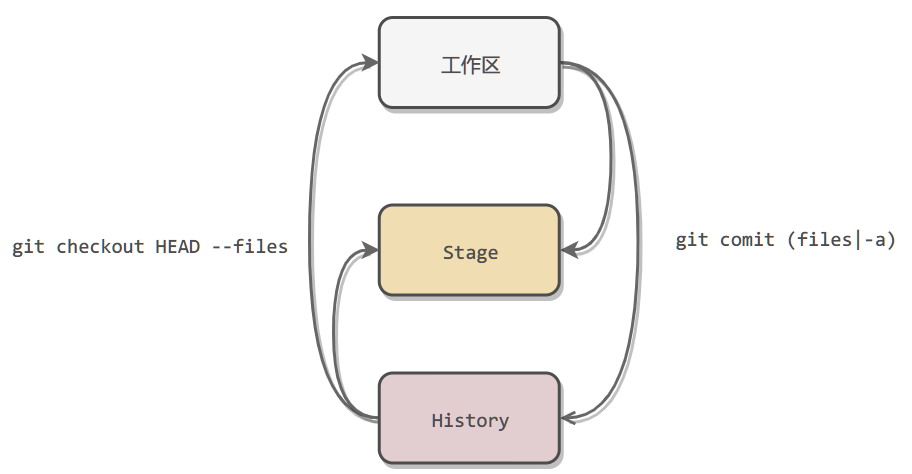
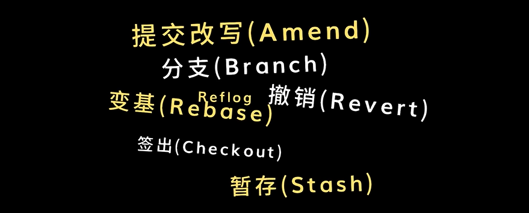

<!-- TOC -->

- [1. Git 简介](#1-git-简介)
- [2. Git 工作流程](#2--git-工作流程)
- [3. Git 基本概念](#3-git-基本概念)
- [4. Git 创建仓库](#4-git-创建仓库)
  - [4.1 git init](#41-git-init)
  - [4.2 git clone](#42-git-clone)
  - [4.3 git config](#43-git-config)
- [5. Git 基本操作](#5-git-基本操作)
- [6. Git 分支管理](#6-git-分支管理)
  - [6.1 `branch` 列出/创建分支](#61-branch-列出创建分支)
  - [6.2 `checkout` 切换分支](#62-checkout-切换分支)
  - [6.3 `branch -d` 删除分支](#63-branch--d-删除分支)
  - [6.4 `merge` 合并分支](#64-merge-合并分支)
  - [6.5 合并冲突](#65-合并冲突)
- [7. `log` 查看提交历史](#7-log-查看提交历史)
- [8. Git 标签](#8-git-标签)
- [9. Git 服务器搭建](#9-git-服务器搭建)
  - [9. 1 安装Git](#9-1-安装git)
  - [9. 2 创建证书登录](#9-2-创建证书登录)
  - [9.3 初始化Git仓库](#93-初始化git仓库)
  - [9.4 克隆仓库](#94-克隆仓库)
- [10. Github 使用](#10-github-使用)
  - [10.1 基础功能](#101-基础功能)
  	- [1）创建提交](#1创建提交)
  	- [2）合并](#2合并)
  	- [3）常用指令](#3常用指令)
  - [10.2 高阶功能](#102-高阶功能)
  	- [1）Amend——提交改写](#1-amend提交改写)
  	- [2）Branch——分支](#2branch分支)
  	- [3）Merge Branch——合并分支](#3-merge-branch合并分支)
  	- [4）Stash——暂存](#4-stash暂存)
    - [5）Rebase——变基](#5-rebase变基)
  	- [6）Checkout——签出功能](#6checkout签出功能)
    - [7）Undoing——撤销操作](#7undoing撤销操作)
  	- [8）图形化Git客户端](#8-图形化git客户端)   
  - [10.3 常用操作](#常用操作)

<!-- /TOC -->

---


---
# 1. Git 简介

Git是一个开源的**分布式**版本控制系统，用于敏捷高效地处理任何或小或大的项目。Git 是 Linus Torvalds 为了帮助管理 Linux 内核开发而开发的一个开放源码的版本控制软件。

Git 与常用的版本控制工具 SVN（subversion），CVS等不同，它采用了分布式版本库的方式，不必服务器端软件支持。Git 特性：**Git 把内容按元数据方式存储**；**Git 没有一个全局的版本号**；**Git 的内容存储使用的是 SHA-1 哈希算法**。这能确保代码内容的完整性，确保在遇到磁盘故障和网络问题时降低对版本库的破坏。



# 2.  Git 工作流程

一般工作流程如下：

- 克隆 Git 资源作为工作目录。
- 在克隆的资源上添加或修改文件。
- 如果其他人修改了，你可以更新资源。
- 在提交前查看修改。
- 提交修改。
- 在修改完成后，如果发现错误，可以撤回提交并再次修改并提交。

Git 工作流程：


---

# 3. Git 基本概念

- **工作区**：本地能看到的目录。
- **版本库**：工作区中的隐藏目录 **.git**。
- **暂存区 (stage)**： 或 index（索引）。一般存放在 **.git** 目录下的 index 文件（`.git/index`）中。

下图展示了工作区、版本库中的暂存区和版本库之间的关系：


- 图中左侧为工作区，右侧为版本库。在版本库中标记为【index】的区域是**暂存区**（`stage/index`），标记为【master】的是 master 分支所代表的目录树。
- 图中【HEAD】是指向【master】分支的一个游标。所以图示的命令中出现 HEAD 的地方可以用 master 替换。
- 图中【objects】标识的区域为 **Git 的对象库**，位于 `.git/objects` 目录下，包含了**创建的各种对象及内容**。
- 当对工作区修改（或新增）的文件执行 **`git add`** 命令时，暂存区的目录树被更新，同时工作区修改（或新增）的文件内容被写入到对象库中的一个新的对象中，而**该对象的ID被记录在暂存区的文件索引中**。
- 当执行提交操作 **`git commit`** 时，暂存区（stage）的目录树写到对象库（objects）中，master 分支也会做相应的更新。即 master 指向的目录树就是提交时暂存区的目录树。
- 当执行 **`git reset HEAD`** 命令时，暂存区的目录树会被重写，被 master 分支指向的目录树所替换，但工作区不受影响。
- 当执行 **`git rm --cached <file>`** 命令时，会直接从暂存区删除文件，工作区则不做改变。
- （<font color=red>**危险操作**</font>）当执行 **`git checkout .`** 或者 **`git checkout -- <file>`** 命令时，会**用暂存区全部或指定的文件替换工作区的文件**。它会**清除工作区中未添加到暂存区的改动**。
- （<font color=red>**危险操作**</font>）当执行 **`git checkout HEAD .`** 或者 **`git checkout HEAD <file>`** 命令时，会用 HEAD 指向的 master 分支中的全部或者部分文件替换暂存区和以及工作区中的文件。它会**清除工作区中未提交的改动，也会清除暂存区中未提交的改动**。







---

# 4. Git 创建仓库

## 4.1 git init

Git 使用 **`git init`** 命令初始化一个 Git 仓库。之后会生成一个 `.git` 目录，该目录包含了资源的所有元数据，其他的项目目录保持不变。

使用当前目录作为Git仓库，只需使它初始化：

```shell
git init
```

使用指定目录作为Git仓库：

```shell
git init newrepo
```

初始化后，newrepo 目录下出现一个名为 .git 的目录，所有 Git 需要的数据和资源都存放在这个目录中。

如果当前目录下有几个文件想要纳入版本控制，需要先用 git add 命令告诉 Git 开始对这些文件进行跟踪，然后提交：

```shell
$ git add *.c
$ git add README
$ git commit -m '初始化项目版本'
```

以上命令将目录下以 .c 结尾及 README 文件提交到仓库中。

> **注：** 在 Linux 系统中，commit 信息使用单引号 **'**；Windows 系统，commit 信息使用双引号 **"**。
>
> 所以在 git bash 中 **git commit -m '提交说明'** 这样是可以的，在 Windows 命令行中就要使用双引号 **git commit -m "提交说明"**。

------

## 4.2 git clone

使用 **`git clone`** 从现有 Git 仓库中拷贝项目。克隆仓库的命令格式为：

```shell
git clone <repo>
```

如果需要克隆到指定的目录，可以使用以下命令格式：

```shell
git clone <repo> <directory>
```

**参数说明：**

- **repo：**Git 仓库。
- **directory：**本地目录。

例如，克隆 Ruby 语言的 Git 代码仓库 Grit，可以用下面的命令：

```shell
$ git clone git://github.com/schacon/grit.git
```

执行该命令后，会在当前目录下创建一个名为grit的目录，其中包含一个 .git 的目录，用于保存下载下来的所有版本记录。

自己定义新建的项目名称，可以在上面的命令末尾指定新的名字：

```shell
$ git clone git://github.com/schacon/grit.git mygrit
```

---

## 4.3 git config

Git 设置使用 **git config** 命令。显示当前的 git 配置信息：

```shell
$ git config --list

credential.helper=osxkeychain
core.repositoryformatversion=0
core.filemode=true
core.bare=false
core.logallrefupdates=true
core.ignorecase=true
core.precomposeunicode=true
```

编辑 git 配置文件:

```shell
$ git config -e    # 针对当前仓库 
```

或者：

```shell
$ git config -e --global   # 针对系统上所有仓库
```

设置提交代码时的用户信息：

```shell
$ git config --global user.name "runoob"
$ git config --global user.email test@runoob.com
```

如果去掉 **--global** 参数只对当前仓库有效。

---

# 5. Git 基本操作

Git 的工作就是创建和保存项目的快照及与之后的快照进行对比。

Git 常用的是以下 6 个命令：**git clone**、**git push**、**git add** 、**git commit**、**git checkout**、**git pull**。


**说明：**

- workspace：工作区
- staging area：暂存区/缓存区
- local repository：版本库或本地仓库
- remote repository：远程仓库

一个简单的操作步骤：

```shell
$ git init    
$ git add .    
$ git commit  
```

- `git init` - 初始化仓库。
- `git add .` - 添加文件到暂存区。
- `git commit` - 将暂存区内容添加到仓库中。

git 创建仓库的命令：

| 命令        | 说明                                   |
| :---------- | :------------------------------------- |
| `git init`  | 初始化仓库                             |
| `git clone` | 拷贝一份远程仓库，也就是下载一个项目。 |

------

**提交与修改**

有关创建与提交项目快照的命令：

| 命令         | 说明                                     |
| :----------- | :--------------------------------------- |
| `git add`    | 添加文件到仓库                           |
| `git status` | 查看仓库当前的状态，显示有变更的文件。   |
| `git diff`   | 比较文件的不同，即暂存区和工作区的差异。 |
| `git commit` | 提交暂存区到本地仓库。                   |
| `git reset`  | 回退版本。                               |
| `git rm`     | 删除工作区文件。                         |
| `git mv`     | 移动或重命名工作区文件。                 |

**提交日志**

| 命令               | 说明                                 |
| :----------------- | :----------------------------------- |
| `git log`          | 查看历史提交记录                     |
| `git blame <file>` | 以列表形式查看指定文件的历史修改记录 |

**远程操作**

| 命令         | 说明               |
| :----------- | :----------------- |
| `git remote` | 远程仓库操作       |
| `git fetch`  | 从远程获取代码库   |
| `git pull`   | 下载远程代码并合并 |
| `git push`   | 上传远程代码并合并 |

---

# 6. Git 分支管理

几乎每一种版本控制系统都以某种形式支持分支。使用分支意味着你可以从开发主线上分离开来，然后在不影响主线的同时继续工作。

**创建分支**命令：

```shell
git branch (branchname)
```

**切换分支**命令：

```shell
git checkout (branchname)
```

切换分支时，Git 会用该分支最后提交的快照替换工作目录的内容， 所以多个分支不需要多个目录。

**合并分支**命令：

```shell
git merge 
```

可以多次合并到统一分支， 也可以选择在合并之后直接删除被并入的分支。

先创建一个测试目录：

```shell
$ mkdir gitdemo
$ cd gitdemo/
$ git init
Initialized empty Git repository...
$ touch README
$ git add README
$ git commit -m '第一次版本提交'
[master (root-commit) 3b58100] 第一次版本提交
 1 file changed, 0 insertions(+), 0 deletions(-)
 create mode 100644 README
```

## 6.1 `branch` 列出/创建分支

列出分支基本命令：

```shell
git branch
```

没有参数时，**git branch** 会列出本地的分支。

```shell
$ git branch
* master
```

上述输出表示，有一个 **master** 分支，并且该分支是当前分支。

**`git init`** 默认会创建 **master** 分支。如果要手动创建一个分支，执行 **`git branch (branchname)`** 即可。

```shell
$ git branch testing
$ git branch
* master
  testing
```

可以看到，有了一个新分支 **testing**。

---

## 6.2 `checkout` 切换分支

**`git checkout (branch)`** 切换到要修改的分支。

```shell
$ ls
README
$ echo 'runoob.com' > test.txt
$ git add .
$ git commit -m 'add test.txt'
[master 3e92c19] add test.txt
 1 file changed, 1 insertion(+)
 create mode 100644 test.txt
$ ls
README        test.txt

$ git checkout testing
Switched to branch 'testing'

$ ls
README
```

切换到 **testing** 分支时，添加的新文件 test.txt 被移除了。切换回 **master** 分支时，它们又重新出现了。

```shell
$ git checkout master
Switched to branch 'master'

$ ls
README        test.txt
```

也可以使用 `git checkout -b (branchname)` 命令创建新分支并立即切换到该分支下，从而在该分支中操作。

```shell
$ git checkout -b newtest
Switched to a new branch 'newtest'

$ git rm test.txt 
rm 'test.txt'

$ ls
README

$ touch runoob.php
$ git add .
$ git commit -am 'removed test.txt、add runoob.php'
[newtest c1501a2] removed test.txt、add runoob.php
 2 files changed, 1 deletion(-)
 create mode 100644 runoob.php
 delete mode 100644 test.txt
 
$ ls
README        runoob.php

$ git checkout master
Switched to branch 'master'

$ ls
README        test.txt
```

如你所见，我们创建了一个分支，在该分支的上移除了一些文件 test.txt，并添加了 runoob.php 文件，然后切换回我们的主分支，删除的 test.txt 文件又回来了，且新增加的 runoob.php 不存在主分支中。

使用分支将工作切分开来，从而让我们能够在不同开发环境中做事，并来回切换。

## 6.3 `branch -d` 删除分支

删除分支命令：

```shell
git branch -d (branchname)
```

例如要删除 testing 分支：

```shell
$ git branch
* master
  testing

$ git branch -d testing
Deleted branch testing (was 85fc7e7).

$ git branch
* master
```

## 6.4 `merge` 合并分支

将任何分支合并到当前分支：

```shell
$ git branch
* master
  newtest
  
$ ls
README        test.txt

$ git merge newtest
Updating 3e92c19..c1501a2
Fast-forward
 runoob.php | 0
 test.txt   | 1 -
 2 files changed, 1 deletion(-)
 create mode 100644 runoob.php
 delete mode 100644 test.txt
 
$ ls
README        runoob.php
```

上例将 newtest 分支合并到主分支，test.txt 文件被删除。

合并完后就可以删除分支:

```shell
$ git branch -d newtest
Deleted branch newtest (was c1501a2).
```

删除后， 就只剩下 master 分支了：

```shell
$ git branch
* master
```

## 6.5 合并冲突

Git 合并不只是简单的文件添加、移除操作，也会合并修改。

```shell
$ git branch
* master
$ cat runoob.php
```

首先，创建一个 change_site 的分支，切换过去，将 runoob.php 内容改为：

```shell
<?php
echo 'runoob';
?>
```

创建 change_site 分支：

```shell
$ git checkout -b change_site
Switched to a new branch 'change_site'

$ vim runoob.php
$ head -3 runoob.php
<?php
echo 'runoob';
?>

$ git commit -am 'changed the runoob.php'
[change_site 7774248] changed the runoob.php
 1 file changed, 3 insertions(+)
```

将修改的内容提交到 change_site 分支中。切换回 master 分支可以看内容恢复到修改前的状态(空文件，没有代码)。再次修改 runoob.php 文件。

```shell
$ git checkout master
Switched to branch 'master'

$ cat runoob.php
$ vim runoob.php    # 修改内容如下
$ cat runoob.php
<?php
echo 1;
?>

$ git diff
diff --git a/runoob.php b/runoob.php
index e69de29..ac60739 100644
--- a/runoob.php
+++ b/runoob.php
@@ -0,0 +1,3 @@
+<?php
+echo 1;
+?>

$ git commit -am '修改代码'
[master c68142b] 修改代码
 1 file changed, 3 insertions(+)
```

现在这些改变已经记录到 master 分支了。接下来将 "change_site" 分支合并。

```shell
$ git merge change_site
Auto-merging runoob.php
CONFLICT (content): Merge conflict in runoob.php
Automatic merge failed; fix conflicts and then commit the result.

$ cat runoob.php     # 代开文件，看到冲突内容
<?php
<<<<<<< HEAD
echo 1;
=======
echo 'runoob';
>>>>>>> change_site
?>
```

将前一个分支合并到 master 分支，一个合并冲突就出现了，接下来**需要手动去修改它**。

```shell
$ vim runoob.php 
$ cat runoob.php
<?php
echo 1;
echo 'runoob';
?>
$ git diff
diff --cc runoob.php
index ac60739,b63d7d7..0000000
--- a/runoob.php
+++ b/runoob.php
@@@ -1,3 -1,3 +1,4 @@@
  <?php
 +echo 1;
+ echo 'runoob';
  ?>
```

可以用 `git add` 要告诉 Git 文件冲突已经解决。

```shell
$ git status -s
UU runoob.php

$ git add runoob.php

$ git status -s
M  runoob.php

$ git commit
[master 88afe0e] Merge branch 'change_site'
```

现在成功解决了合并中的冲突，并提交了结果。

---

# 7. `log` 查看提交历史

Git 提交历史一般常用两个命令：

- **`git log`** - 查看历史提交记录。
- **`git blame <file>`** - 以列表形式查看指定文件的历史修改记录。

```shell
$ git log
  commit d5e9fc2c811e0ca2b2d28506ef7dc14171a207d9 (HEAD -> master)
  Merge: c68142b 7774248
  Author: runoob <test@runoob.com>
  Date:   Fri May 3 15:55:58 2019 +0800
  
      Merge branch 'change_site'
  
  commit c68142b562c260c3071754623b08e2657b4c6d5b
  Author: runoob <test@runoob.com>
  Date:   Fri May 3 15:52:12 2019 +0800
  
      修改代码
  
  commit 777424832e714cf65d3be79b50a4717aea51ab69 (change_site)
  Author: runoob <test@runoob.com>
  Date:   Fri May 3 15:49:26 2019 +0800
  
      changed the runoob.php
  
  commit c1501a244676ff55e7cccac1ecac0e18cbf6cb00
  Author: runoob <test@runoob.com>
  Date:   Fri May 3 15:35:32 2019 +0800
```

可以用 `--oneline` 选项查看历史记录的简洁的版本。

```shell
  $ git log --oneline
  $ git log --oneline
  d5e9fc2 (HEAD -> master) Merge branch 'change_site'
  c68142b 修改代码
  7774248 (change_site) changed the runoob.php
  c1501a2 removed test.txt、add runoob.php
  3e92c19 add test.txt
  3b58100 第一次版本提交
```
上述输出结果显示的是此项目的开发历史。

还可以用 `--graph` 选项，查看历史中什么时候出现了分支、合并。

```shell
  *   d5e9fc2 (HEAD -> master) Merge branch 'change_site'
  |\  
  | * 7774248 (change_site) changed the runoob.php
  * | c68142b 修改代码
  |/  
  * c1501a2 removed test.txt、add runoob.php
  * 3e92c19 add test.txt
  * 3b58100 第一次版本提交
```
现在可以更清楚明了地看到何时工作分叉、又何时归并。

也可以用 **`--reverse`** 参数来逆向显示所有日志。

```shell
  $ git log --reverse --oneline
  3b58100 第一次版本提交
  3e92c19 add test.txt
  c1501a2 removed test.txt、add runoob.php
  7774248 (change_site) changed the runoob.php
  c68142b 修改代码
  d5e9fc2 (HEAD -> master) Merge branch 'change_site'
```
查找指定用户的提交日志：`git log --author` 。
```shell
  $ git log --author=Linus --oneline -5
  
  81b50f3 Move 'builtin-*' into a 'builtin/' subdirectory
  3bb7256 make "index-pack" a built-in
  377d027 make "git pack-redundant" a built-in
  b532581 make "git unpack-file" a built-in
  112dd51 make "mktag" a built-in
```
如果要指定日期，可以使用：`--since` 和 `--before`。也可以用 `--until` 和 `--after`。

例如，要看 Git 项目中三周前且在四月十八日之后的所有提交，可以执行（ --no-merges 选项以隐藏合并提交）：

```shell
$ git log --oneline --before={3.weeks.ago} --after={2010-04-18} --no-merges

  5469e2d Git 1.7.1-rc2
  d43427d Documentation/remote-helpers: Fix typos and improve language
  272a36b Fixup: Second argument may be any arbitrary string
  b6c8d2d Documentation/remote-helpers: Add invocation section
  5ce4f4e Documentation/urls: Rewrite to accomodate transport::address
  00b84e9 Documentation/remote-helpers: Rewrite description
  03aa87e Documentation: Describe other situations where -z affects git diff
  77bc694 rebase-interactive: silence warning when no commits rewritten
  636db2c t3301: add tests to use --format="%N"
```
更多 git log 命令可查看：http://git-scm.com/docs/git-log

---

**`git blame`** 查看指定文件的修改记录：

```shell
git blame <file>
```
git blame 命令是以列表形式显示修改记录，如下实例：

```shell
$ git blame README 
^d2097aa (tianqixin 2020-08-25 14:59:25 +0800 1) # Runoob Git 测试
db9315b0 (runoob    2020-08-25 16:00:23 +0800 2) # 菜鸟教程 
```

---
# 8. Git 标签

如果达到一个重要的阶段，并希望永远记住那个特别的提交快照，可以使用 `git tag` 打标签。

比如，想为的 runoob 项目发布一个"1.0"版本。 可以用 `git tag -a v1.0` 命令给最新一次提交打上（HEAD）"v1.0" 的标签。

`-a` 选项意为创建一个带注解的标签（记录这标签是啥时候打的，谁打的）。

```shell
$ git tag -a v1.0 
```

执行 `git tag -a` 命令会自动打开编辑器，请求你填写标签注解。

执行 `git log --decorate` 可以看到标签：

```shell
*   d5e9fc2 (HEAD -> master) Merge branch 'change_site'
|\  
| * 7774248 (change_site) changed the runoob.php
* | c68142b 修改代码
|/  
* c1501a2 removed test.txt、add runoob.php
* 3e92c19 add test.txt
* 3b58100 第一次版本提交
```

**如果忘了给某个提交打标签，又将它发布了，可以给它追加标签**。

例如，假设发布了提交 85fc7e7(上面实例最后一行)，但忘了打标签。 现在可以追加标签：

```shell
$ git tag -a v0.9 85fc7e7

$ git log --oneline --decorate --graph
*   d5e9fc2 (HEAD -> master) Merge branch 'change_site'
|\  
| * 7774248 (change_site) changed the runoob.php
* | c68142b 修改代码
|/  
* c1501a2 removed test.txt、add runoob.php
* 3e92c19 add test.txt
* 3b58100 (tag: v0.9) 第一次版本提交
```

查看所有标签：

```shell
$ git tag
v0.9
v1.0
```

指定标签信息：

```shell
git tag -a <tagname> -m "runoob.com标签"
```

PGP签名标签：

```shell
git tag -s <tagname> -m "runoob.com标签"
```

---
# 9. Git 服务器搭建
我们可以自己搭建一台 Git 服务器作为私有仓库使用。

接下来以 Centos 为例搭建 Git 服务器。

## 9. 1 安装Git

```shell
$ yum install curl-devel expat-devel gettext-devel openssl-devel zlib-devel perl-devel
$ yum install git
```

创建一个git用户组和用户，用来运行git服务：

```shell
$ groupadd git
$ useradd git -g git
```

## 9. 2 创建证书登录

收集所有需要登录的用户的公钥，公钥位于id_rsa.pub文件中，把我们的公钥导入到/home/git/.ssh/authorized_keys文件里，一行一个。

如果没有该文件创建它：

```shell
$ cd /home/git/
$ mkdir .ssh
$ chmod 755 .ssh
$ touch .ssh/authorized_keys
$ chmod 644 .ssh/authorized_keys
```

## 9.3 初始化Git仓库

首先选定一个目录作为Git仓库，假定是/home/gitrepo/runoob.git，在/home/gitrepo目录下输入命令：

```shell
$ cd /home
$ mkdir gitrepo
$ chown git:git gitrepo/
$ cd gitrepo

$ git init --bare runoob.git
Initialized empty Git repository in /home/gitrepo/runoob.git/
```

以上命令Git创建一个空仓库，服务器上的Git仓库通常都以.git结尾。然后，把仓库所属用户改为git：

```shell
$ chown -R git:git runoob.git
```

## 9.4 克隆仓库

```shell
$ git clone git@192.168.45.4:/home/gitrepo/runoob.git
Cloning into 'runoob'...
warning: You appear to have cloned an empty repository.
Checking connectivity... done.
```

192.168.45.4 为 Git 所在服务器 ip ，需要将其修改为你自己的 Git 服务 ip。

至此，Git 服务器安装完成。

---

# 10. Github 使用

---

## 10.1 基础功能

在编写代码时，希望保存不同的代码版本，当软件出现bug时，可以回溯到之前的状态，比较版本之间的差别，从而找出bug的源头。此外，在多人分工协作的时候，也经常修改到相同的文件，此时若有一个工具可以帮助完成修改的合并，就可以帮助我们节省不少的时间。版本控制系统应运而生！

Git就是版本控制工具之一，其适用于中小项目的开发。

GitKraken是一个图形化客户端，比较适合入门。

---
### 1）创建提交
在本地仓库中添加代码或增删修改文件之后，GitKraken界面中，会出现WIP的提示，这表示“正在施工中”（working in progress），点击之后，右侧边栏中看到多出的或者修改的文件列表。点击可查看修改的内容。

提交步骤：点击Stage，填写commit信息，然后点击commit提交。如果要同步到远程服务器，需要使用push功能。origin是指默认的远程服务器。

---
### 2）合并
可以使用Pull功能，将远程仓库的提交合并到本地仓库。此时，修改已经自动合并。如果同时修改一段代码，则会提示冲突（Git 不止如何合并），这时就需要手动处理冲突！修改之后，重新commit

---
### 3）常用指令
1. 配置用户基本信息：
`git config --global user.name <用户名>`
`git config --global user.email <邮箱>`
2. 创建一个新仓库：`git init`
3. 从远程服务器克隆一个仓库：`git clone <远程仓库的 Url>`
4. 显示当前的工作目录下的提交文件状态：`git status`
5. 将指定文件Stage（标记为将要被提交的文件）：`git add <文件路径>`
6. 将指定恩建Unstage（取消标记为将要被提交的文件）：`git reset <文件路径>`
7. 创建一个提交并提供提交信息：`git commit -m “提交信息”`
8. 显示提交历史：`git log`
9. 向远程仓库推送（Push）：`git push`

---
## 10.2 高阶功能

 

### 1）Amend——提交改写

有时在完成提交后会发现提交中的代码有误，或者提交信息有误。amend可以用来对已提交的文件或者提交信息进行修改，最好对只对本地的提交使用。使用方法为：当发现提交错误后，再按照之前的步骤再次提交，只不过需要勾选amend，这个提交并不会创建一个新的提交，而只是修改之前已经存在的提交。

---

### 2）Branch——分支

有时不确定自己修改的代码是否有bug，其次我们也不希望这个实验性的功能出现在软件的发布版本上，因为很可能这个功能并不实用。此时可以使用Git中的分支功能将软件发布版本和实验性功能区分开来，Branch之间不会相互影响。

---

### 3）Merge Branch——合并分支

注意如果出现报错，则需要手动解决冲突。push操作默认只会推送master分支，如果想将其他分支进行推送，则需要单独进行push。

---

### 4）Stash——暂存

如果在修改当前分支的内容时，需要处理另一个分支的bug，则可以将当前的修改暂存起来。注意Stage和Stash虽然均可翻译为暂存，但是它们的功能则完全不同。

GitKraken中的操作：首先点击Stash，然后在左侧边栏中可以发现有Stash这一栏；之后进行其它分支的操作，当操作完成后，再点击Pop按钮，恢复之前正在进行的修改。

---

### 5）Rebase——变基

与merge不同的是，rebase在合并分支的过程中，会直接将整个分支取下来，嫁接在另一个分支上，由于改变了原有分支的基底，这也是名字变基的由来。通过变基得到的提交历史不会出现分叉，看起来简洁直观。变基之后的历史呈现一条直线，非常直观。

使用merge提交，原先的提交的提交历史会被完全保留，

---

### 6）Checkout——签出功能

恢复代码之前的版本完成bug的修复，此时checkout就派上用场了。注意HEAD指向的是当前提交，之前因为我们都在main和test分支下工作，HEAD指向的自然就是main分支和test分支自己。由于目前我们已经是脱离分支的状态，而HEAD在这里就代表我们当前正处于的这个提交。

完成修改之后，可以创建一个新的commit，然后使用左侧边栏中，右击main分支，选择Fast-Forward to main，使HEAD指向main。

---

### 7）Undoing——撤销操作

如果你在Git中提交了代码或者错误合并了一个分支，可以使用undoing操作。在Git中的每一次操作都被记录在称为reflog的文件里，利用它可以轻松帮你回退到之前的状态。

在GitKraken中，可以直接点击undo按钮，实现撤销操作！如果已经提交到远程服务器，那么这个操作无效。

注意，不要修改远程仓库的提交历史，因为所有开发者都为护着同一个开发历史，如果自己擅自修改之后，别人的记录就对不上了。

撤销已经提交的代码，可以使用Git中的revert功能，在提交上右击，选择revert commit。可以看到生成了一个新的commit，这说明Git没有去修改原来的提交历史，而是生成了一个与之前提交完全相反的新提交。

---

### 8）图形化Git客户端

- SourceTree
- SmartGit
- TortoiseGit

---

## 10.3 常用操作

1. 修改（Amend）上一个提交：

   `git commit --amend -m "<新提交信息>"`

2. 查看所有分支：`git branch`

3. 创建新分支：`git branch <分支名字>`

4. 切换分支：`git checkout <分支名字>`

5. 重命名分支：`git branch -m <旧名字><新名字>`
6. 删除分支：`git branch -d <分支名字>`
7. 将分支变基（Rebase）到main（需要先切换到分支之后，再完成变基）：
`git checkout <分支名字>`
`git rebase main`
8. 使用快进（Fast-Forward将分支合并到master）：
`git checkout <分支名字>`
`git merge --ff-only `
9. 中止这一次提交的合并（当遇到冲突时）：`git merge --abort`
10. 将未提交的修改暂存（Stash）：`git stash save "<可以输入一个信息>"`
11. 将上一个暂存的修改恢复并从暂存列表中删除：`git stash pop`
12. 签出指定的提交：`git checkout <提交的hash>`
13. 撤销旧提交：`git revert <旧提交的hash>`
14. 利用reflog查看本地仓库中的所有操作：`git reflog`

---
> Ref:
>
> 1. Git 官方文档：https://git-scm.com/doc
> 2. [Git + GitHub 10分钟完全入门（video）](https://www.bilibili.com/video/BV1KD4y1S7FL/?spm_id_from=333.788.recommend_more_video.-1)
> 3. [Git 进阶教程（video）](https://www.bilibili.com/video/BV1hA411v7qX)
> 4. [Git 教程](https://www.runoob.com/git/git-tutorial.html)
