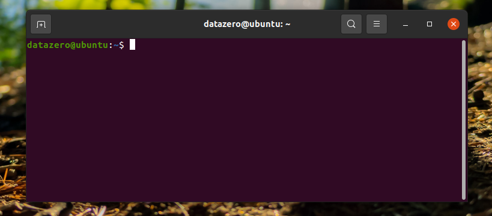
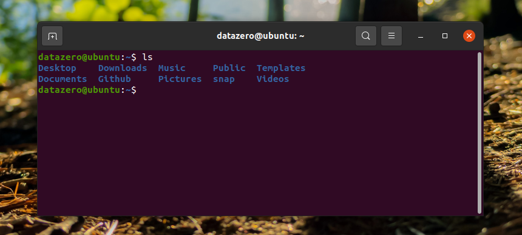

<!-- TOC -->

- [Shell Basic Usage](#shell-basic-usage)
- [1. Shell 简介](#1-shell-简介)
  - [1.1 Shell 环境](#11-shell-环境)
  - [1.2 Shell 连接用户和内核](#12-shell-连接用户和内核)
  - [1.3 Shell 连接其它程序](#13-shell-连接其它程序)
  - [1.4 Shell 支持编程](#14-shell-支持编程)
  - [1.5 Shell 是脚本语言](#15-shell-是脚本语言)
    - [1）什么是脚本语言？](#1什么是脚本语言)
    - [2）进入 Shell 命令的方式](#2进入-shell-命令的方式)
  - [1.6 Perl、Python 和 Shell](#16-perlpython-和-shell)
    - [1）Perl](#1perl)
    - [2）Python](#2python)
    - [3）Shell](#3shell)
- [2. Shell 命令的基本格式](#2-shell-命令的基本格式)
  - [2.1 使用参数](#21-使用参数)
  - [2.2 选项附带参数](#22-选项附带参数)
  - [2.3 第二层命令提示符](#23-第二层命令提示符)
- [3. 运行 Shell 脚本](#3-运行-shell-脚本)
  - [3.1 作为可执行程序](#31-作为可执行程序)
  - [3.2 作为解释器参数](#32-作为解释器参数)

<!-- /TOC -->

---
# Shell Basic Usage
---
# 1. Shell 简介

现代操作系统（Windows、Mac OS、iOS 等）都是带图形界面的，简单直观，容易上手。然而计算机早期并没有图形界面，只能通过一个个地命令来控制计算机，这些命令有成百上千之多，只有专业人员才能使用。

图形界面和命令行要达到的目的是一样的，都是让用户控制计算机。然而，真正能够控制计算机硬件（CPU、内存、显示器等）的只有操作系统内核（Kernel），图形界面和命令行只是架设在用户和内核之间的一座桥梁。

由于安全、复杂、繁琐等原因，用户不能直接接触内核（也没有必要），需要另外再开发一个程序，让用户直接使用这个程序；该程序的作用就是接收用户的操作（点击图标、输入命令），并进行简单的处理，然后再传递给内核，这样用户就能间接地使用操作系统内核了。类似于在用户和内核之间增加一层“代理”，既能简化用户的操作，又能保障内核的安全。

用户界面和命令行就是这个另外开发的程序，就是这层“代理”。在Linux下，这个命令行程序叫做 **Shell**。

Shell 是一个用 C 语言编写的应用程序，它提供了一个界面，连接了用户和 Linux 内核，让用户能够更加高效、安全、低成本地使用 Linux 内核，这就是 Shell 的本质。

Shell 本身并不是内核的一部分，它只是站在内核的基础上编写的一个应用程序。然而 Shell 也有着它的特殊性，就是开机立马启动，并呈现在用户面前；用户通过 Shell 来使用 Linux，不启动 Shell 的话，用户就没办法使用 Linux。

## 1.1 Shell 环境

Shell 编程只要有一个能编写代码的文本编辑器和一个能解释执行的脚本解释器即可。

常见的 Linux 的 Shell 有：

- Bourne Shell（/usr/bin/sh或/bin/sh）：是UNIX最初使用的 shell，而且在每种 UNIX 上都可以使用。Bourne Shell 在 shell 编程方面相当优秀，但在处理与用户的交互方面做得不如其他几种 shell。
- Bourne Again Shell（/bin/bash）：LinuxOS 默认的，它是 Bourne Shell 的扩展。 与 Bourne Shell 完全兼容，并且在 Bourne Shell 的基础上增加了很多特性。可以提供命令补全，命令编辑和命令历史等功能。它还包含了很多 C Shell 和 Korn Shell 中的优点，有灵活和强大的编辑接口，同时又很友好的用户界面。
- C Shell（/usr/bin/csh）：是一种比 Bourne Shell更适合的变种 Shell，它的语法与 C 语言很相似。
- K Shell（/usr/bin/ksh）：集合了 C Shell 和 Bourne Shell 的优点并且和 Bourne Shell 完全兼容。
- Tcsh：是 Linux 提供的 C Shell 的一个扩展版本。Tcsh 包括命令行编辑，可编程单词补全，拼写校正，历史命令替换，作业控制和类似 C 语言的语法，他不仅和 Bash Shell 提示符兼容，而且还提供比 Bash Shell 更多的提示符参数。

本教程关注的是 Bash，也就是 Bourne Again Shell，由于易用和免费，Bash 在日常工作中被广泛使用。同时，Bash 也是大多数Linux 系统默认的 Shell。

在一般情况下，人们并不区分 Bourne Shell 和 Bourne Again Shell，所以，像 **`#!/bin/sh`**，它同样也可以改为 **`#!/bin/bash`**。

<font color=red>**`#!`：告诉系统其后路径所指定的程序即是解释此脚本文件的 Shell 程序，即使用哪一种解释器（Shell）来执行。**</font>

## 1.2 Shell 连接用户和内核

Shell 能够接收用户输入的命令，并对命令进行处理，处理完毕后再将结果反馈给用户，比如输出到显示器、写入到文件等，这就是大部分读者对 Shell 的认知。

其实，Shell 程序本身的功能是很弱的，比如文件操作、输入输出、进程管理等都得依赖内核。我们运行一个命令，大部分情况下 Shell 都会去调用内核暴露出来的接口，这就是在使用内核，只是这个过程被 Shell 隐藏了起来了。

**接口**就是一个个函数，**使用内核就是调用这些函数**。

比如，在 Shell 中输入`cat log.txt `命令就可以查看 log.txt 文件中的内容，然而，log.txt 放在磁盘的哪个位置？分成了几个数据块？在哪里开始？在哪里终止？如何操作探头读取它？这些底层细节 Shell 统统不知道的，它只能去调用内核提供的 open() 和 read() 函数，告诉内核要读取 log.txt 文件，然后内核就按照 Shell 的吩咐去读取文件，并将读取到的文件内容交给 Shell，最后再由 Shell 呈现给用户（其实呈现到显示器上还得依赖内核）。整个过程中 Shell 就是一个中间人，在用户和内核之间“倒卖”数据，只是用户不知道罢了。

## 1.3 Shell 连接其它程序

在 Shell 中输入的命令，有一部分是 Shell 自带的，叫做**内置命令**；有一部分是其它的应用程序（一个程序就是一个命令），叫做**外部命令**。

Shell 本身支持的命令并不多，功能也有限，但是 Shell 可以调用其他程序，每个程序就是一个命令，这使得 Shell 命令的数量可以无限扩展，功能非常强大，完全能够胜任 Linux 的日常管理工作，如文本或字符串检索、文件的查找或创建、大规模软件的自动部署、更改系统设置、监控服务器性能、发送报警邮件、抓取网页内容、压缩文件等。

此外，Shell 还可以让多个外部程序发生连接，在它们之间很方便地传递数据，也就是把一个程序的输出结果传递给另一个程序作为输入。

Shell 强大是因为它擅长使用和组织其他程序。Shell 是一个领导者，这正是其魅力所在。

可以将 Shell 在整个 Linux 系统中的地位描述成下图。注意“用户”和“其它应用程序”是通过虚线连接的，因为用户启动 Linux 后直接面对的是 Shell，通过 Shell 才能运行其它的应用程序。


## 1.4 Shell 支持编程

Shell 并不是简单的堆砌命令，还可以在 Shell 中编程，这和使用如C++、Java、Python等编程语言没有什么两样。

Shell 虽然没有 C++、Java、Python 等强大，但也支持基本的编程元素：

- if...else 选择结构，case...in 开关语句，for、while、until 循环；
- 变量、数组、字符串、注释、加减乘除、逻辑运算等概念；
- 函数，包括用户自定义的函数和内置函数（例如 printf、export、eval 等）。

在这个角度讲，**Shell 也是一种编程语言，它的编译器（解释器）是 Shell 这个程序**。平时所说的 Shell，有时候是指连接用户和内核的这个程序，有时候又是指 Shell 编程。

**Shell 主要用来开发一些实用的、自动化的小工具**，而不是用来开发具有复杂业务逻辑的中大型软件，例如检测计算机的硬件参数、搭建 Web 运行环境、日志分析等，Shell 都非常合适。

## 1.5 Shell 是脚本语言

任何代码最终都要被“翻译”成二进制的形式才能在计算机中执行。

有的编程语言，如 C/C++、Pascal、Go语言、汇编等，必须在程序运行之前将所有代码都翻译成二进制形式，也就是生成可执行文件，用户拿到的是最终生成的可执行文件，看不到源码。这个过程叫做**编译（Compile）**，这样的编程语言叫做**编译型语言**，完成编译过程的软件叫做**编译器（Compiler）**。

而像Shell、JavaScript、Python、PHP等，需要边执行边翻译，不会生成任何可执行文件，用户必须拿到源码才能运行程序。程序运行后会即时翻译，翻译完一部分执行一部分，不用等到所有代码都翻译完。这个过程叫做**解释（interpret）**，这样的编程语言叫做**解释型语言**或者**脚本语言（Script）**，完成解释过程的软件叫做**解释器（Interpreter）**。

编译型语言的优点：执行速度快、对硬件要求低、保密性好，适合开发操作系统、大型应用程序、数据库等。

脚本语言的优点：使用灵活、部署容易、跨平台性好，适合 Web 开发以及小工具等。

Shell 就是一种脚本语言，编写完源码后不用编译，直接运行源码即可。

### 1）什么是脚本语言？

**脚本语言是像剧本一样教计算机办某个事情的语言**。

比如想让计算机执行复制某个文件的操作，如：**cp ~/Desktop/\*.txt ~/text**

可以在文本编辑器写入上边的代码并且保存此文件，然后通过执行这个文本文件来执行上面的代码，并不需要重复手动输入上边的代码。

所以脚本其实就是**短小的、用来让计算机自动化完成一系列工作的程序**，这类程序可以用文本编辑器修改，不需要编译，通常是解释运行的。

### 2）进入 Shell 命令的方式

一种进入 Shell 的方法是让 Linux 系统退出图形界面模式，进入控制台模式，显示器上只有一个简单的带着白色文字的黑屏。这种模式称为 Linux 控制台（Console）。

**另一种进入 Shell 的一种方法是使用Linux 桌面环境中的终端模拟包（Terminal emulation package，即 Terminal），这样在图形桌面中就可以使用 Shell**。

---

## 1.6 Perl、Python 和 Shell

Shell是Linux运维人员必须掌握的技能。除了 Shell，能够用于 Linux 运维的脚本语言还有 Python 和 Perl。

### 1）Perl

Perl 比 Shell 强大很多，在 2010 年以前很流行，它的语法灵活、复杂，在实现不同的功能时可以用多种不同的方式，缺点是不易读，团队协作困难。

Perl 脚本已经成为历史了，现在的 Linux 运维人员几乎不需要了解 Perl 了，最多可以了解一下 Perl 的安装环境。

### 2）Python

Python 是近几年非常流行的语言，它不但可以用于脚本程序开发，也可以实现 Web 程序开发（例如：知乎、豆瓣、YouTube、Instagram），甚至还可以实现软件的开发、游戏开发、[大数据](http://c.biancheng.net/big_data/)开发、移动端开发。

**Python 语言的优势在于开发复杂的运维软件、Web 页面的管理工具和 Web 业务的开发**。例如 CMDB 自动化运维平台、跳板机、批量管理软件 SaltStack、云计算软件 OpenStack 等。

现在越来越多的公司要求运维人员会 Python 自动化开发，Python 也成了运维人员必备的技能，每一个运维人员在熟悉了 Shell 之后，都应该再学习 Python 语言。

### 3）Shell

**Shell 脚本的优势在于处理偏操作系统底层的业务**，例如，Linux 内部的很多应用（有的是应用的一部分）都是使用 Shell 脚本开发的，因为有 1000 多个 Linux 系统命令为它作支撑，特别是 Linux 正则表达式以及三剑客 grep、awk、sed 等命令。

对于一些常见的系统脚本，使用 Shell 开发会更简单、更快速，例如，让软件一键自动化安装、优化，监控报警脚本，软件启动脚本，日志分析脚本等。虽然 Python 也能做到这些，但考虑到掌握难度、开发效率、开发习惯等，Python不如 Shell 脚本有优势。对于一些常见的业务应用，使用 **Shell 更符合 Linux 运维简单、易用、高效的三大原则**。

---

# 2. Shell 命令的基本格式

Linux打开终端，看到Shell如下格式：



- `~` 代表用户当前所在的目录为主目录（home 目录）。超级用户的主目录为`/root/`，普通用户的主目录为`/home/用户名/`。
- `$` 是命令提示符。Linux 用这个符号标识登录的用户权限等级： `#` 表示超级用户（root 用户）； `$` 表示普通用户。命令提示符不是命令的一部分，只起提示作用。

Shell 命令的基本格式如下：

```shell
command [选项] [参数]
```

- `[]`表示可选参数。

ls 是一个常用命令，属于目录操作命令，用来列出当前目录下的文件和文件夹。ls 可以附带选项，也可以不带：



## 2.1 使用参数

参数是命令的操作对象，一般情况下，文件、目录、用户和进程等都可以作为参数被命令操作。例如：

```shell
$ ls -l main.c
```

## 2.2 选项附带参数

有些命令的选项后面也可以附带参数，这些参数用来补全选项，或者调整选项的功能细节。

例如，read 命令用来读取用户输入的数据，并把读取到的数据赋值给一个变量，它通常的用法为：

```shell
read str
```

str 为变量名。

给 read 命令增加 `-n` 选项，可读取固定长度的字符串。比如读取一个字符作为性别的标志，那么可以这样写：

```shell
read -n 1 sex
```

`1` 是 `-n` 选项的参数，`sex` 是 read 命令的参数。`-n` 选项表示读取固定长度的字符串，其后数字用来指明长度。

## 2.3 第二层命令提示符

有些命令不能在一行内输入完成，需要换行，此时会看到第二层命令提示符，默认为 `>`

```shell
$ echo "
> http://
> c.net
> "

http://
c.net
```

---

# 3. 运行 Shell 脚本

## 3.1 作为可执行程序

打开vim文本编辑器，新建一个文件 test.sh，扩展名sh代表shell，扩展名并不影响脚本执行。输入一些代码：

```shell
#!/bin/bash
echo "Hello World !"

echo "What is your name?"
read PERSON
echo "Hello, $PERSON"
```

**echo 命令用于向窗口输出文本。**

第 5 行中表示从终端读取用户输入的数据，并赋值给 PERSON 变量。read 命令用来从标准输入文件（Standard Input，stdin，一般就是指键盘）读取用户输入的数据。

第 6 行表示输出变量 PERSON 的内容。注意在变量名前边要加上`$`，否则变量名会作为字符串的一部分处理。

将上面的代码保存为 test.sh，并 cd 到相应目录：

```shell
chmod +x ./test.sh  #使脚本具有执行权限
./test.sh  #执行脚本
```

注意：一定要写成 **`./test.sh`**，而不是 **test.sh**，运行其它二进制的程序也一样。直接写 test.sh，linux 系统会去 PATH 里寻找有没有叫 test.sh 的，而只有 /bin, /sbin, /usr/bin，/usr/sbin 等在 PATH 里，当前目录通常不在 PATH 里，所以写成 test.sh 是会找不到命令，`./test.sh` 告诉系统在当前目录找。

## 3.2 作为解释器参数

这种运行方式是直接运行解释器，其参数为 shell 脚本的文件名，如：

```shell
/bin/sh test.sh
/bin/php test.php
```

这种方式运行的脚本，不需要在第一行指定解释器信息，写了也没用。

---

> Ref:
>
> 1. [Shell 教程](https://www.runoob.com/linux/linux-system-contents.html)
> 2. [Shell基础](http://c.biancheng.net/view/733.html)

---

