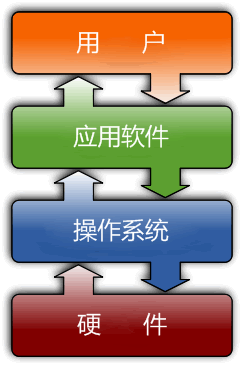

# ROS-Introduction

# 1. 操作系统简介

计算机是一台机器，它按照用户的要求接收信息、存储数据、处理数据，然后再将处理结果输出（文字、图片、音频、视频等）。计算机由硬件和软件组成：

- 硬件是计算机赖以工作的实体，包括显示器、键盘、鼠标、硬盘、CPU、主板等；
- 软件会按照用户的要求协调整台计算机的工作，比如 Windows、Linux、Mac OS、Android 等操作系统，以及 Office、微信等应用程序。

**操作系统（Operating System，OS）**是软件的一部分，它是硬件基础上的第一层软件，是硬件和其它软件沟通的桥梁（或者说接口、中介）。

操作系统会控制其他程序运行，管理系统资源，提供最基本的计算功能，如管理及配置内存、决定系统资源供需的优先次序等，同时还提供一些基本的服务程序，例如：

## 1.1 文件系统

提供计算机存储信息的结构，信息存储在文件中，文件主要存储在计算机的内部硬盘里，在目录的分层结构中组织文件。文件系统为操作系统提供了组织管理数据的方式。

## 1.2 设备驱动程序

提供连接计算机的每个硬件设备的接口，设备驱动器使程序能够写入设备，而不需要了解执行每个硬件的细节。简单来说，就是让你能吃到鸡蛋，但不用养一只鸡。

## 1.3 用户接口
操作系统需要为用户提供一种运行程序和访问文件系统的方法。如常用的 Windows 图形界面，可以理解为一种用户与操作系统交互的方式；智能手机的 Android 或 iOS 系统，也是一种操作系统的交互方式。

## 1.4 系统服务程序

当计算机启动时，会自启动许多系统服务程序，执行安装文件系统、启动网络服务、运行预定任务等操作。

---

> Reference:
>
> 1. [操作系统概述](http://c.biancheng.net/view/705.html)
> 2. 